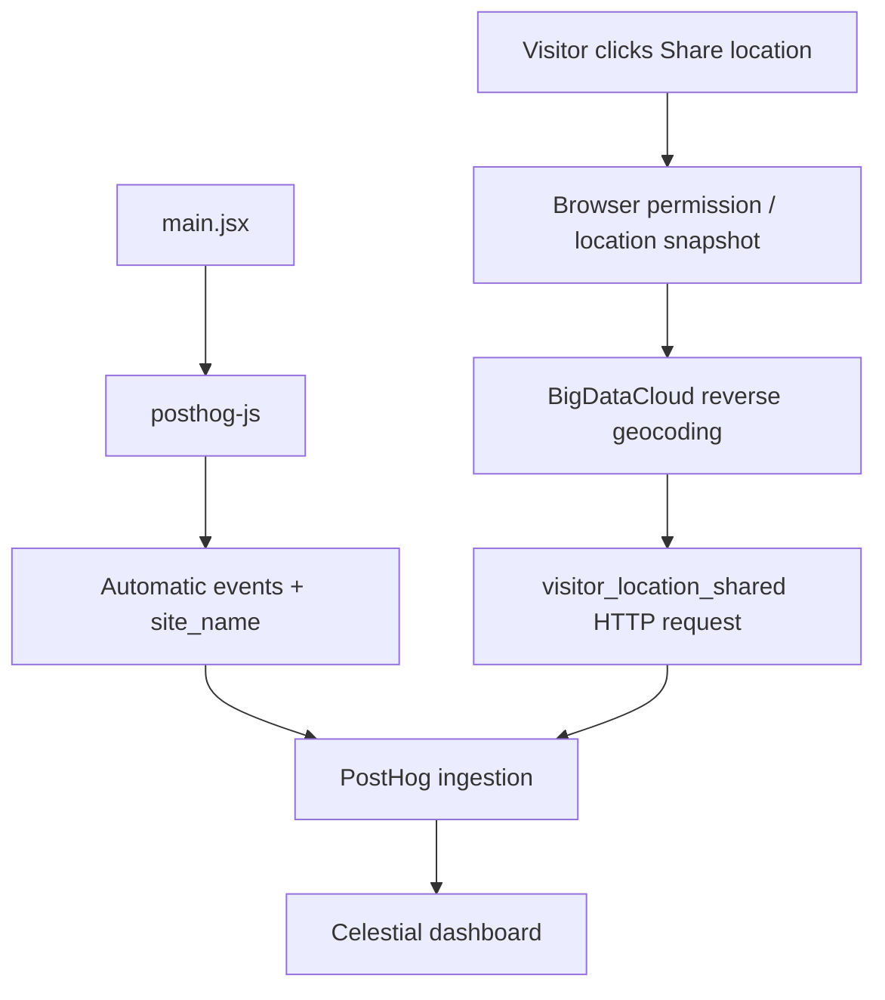

# Celestial PostHog Implementation

## Entry Point and Initialization

[main.jsx](../../src/main.jsx) imports [src/lib/analytics.js](../../src/lib/analytics.js) before rendering the React app. Analytics initialization runs at module load, outside React effects.

The module reads `VITE_POSTHOG_TOKEN`. When it is present, it initializes `posthog-js` using `VITE_POSTHOG_HOST`, falling back to `https://us.i.posthog.com`. If the token is absent, it skips initialization and exports `analyticsEnabled = false`.

| Configuration | Current behavior |
| --- | --- |
| `capture_pageview: 'history_change'` | Automatic initial pageview and SPA pathname navigation |
| `person_profiles: 'identified_only'` | Anonymous browser events; no application `identify()` call |
| `disable_session_recording: true` | No session replay |
| `loaded` callback | Registers `site_name: celestial` for subsequent SDK events |
| `before_send` callback | Adds/overrides `site_name: celestial` on SDK events |

Autocapture uses the SDK's defaults and project settings. Celestial does not configure full DOM text/attribute masking through `mask_all_text` or `mask_all_element_attributes`. Element text and attributes may be included according to the SDK's capture rules; session recording being disabled does not disable interaction analytics.

There is no custom `environment` tag, server-side PostHog SDK, or application ingestion endpoint. SDK events and the location-sharing event are sent directly from the visitor's browser to the configured PostHog host.

## Source Map

| Source | Responsibility |
| --- | --- |
| [src/main.jsx](../../src/main.jsx) | Imports analytics before rendering |
| [src/lib/analytics.js](../../src/lib/analytics.js) | SDK configuration, site tagging, and `shareVisitorLocation()` |
| [src/LocationSharing.jsx](../../src/LocationSharing.jsx) | Optional UI, permission request, status, and remembered visitor choice |
| [src/lib/location.js](../../src/lib/location.js) | Reverse geocoding through BigDataCloud and place-name fallback |
| [src/App.jsx](../../src/App.jsx) | Mounts the location-sharing component in the application shell |
| [src/location-sharing.css](../../src/location-sharing.css) | Location prompt and reopen button styling |
| [.env.example](../../.env.example) | Public analytics variable template |

## Data Flow

## Automatic Events

| Event | Trigger | Relevant data |
| --- | --- | --- |
| `$pageview` | Initial load and supported pathname navigation | URL, pathname, browser/session/referrer properties, `site_name` |
| `$pageleave` | When captured by the SDK's page-leave behavior | Standard SDK navigation/session properties, `site_name` |
| `$autocapture` | Supported DOM interactions when project autocapture is enabled | SDK-generated element/interaction properties, `site_name` |

Enabled pages use their real paths: `/`, `/birthday`, `/moon`, `/shuffle`, `/solar-system`, `/pets`, `/cosmic-age`, `/build-your-planet`, and `/gravity-playground`. The additional discovery registry is [src/lib/discoveries.js](../../src/lib/discoveries.js). Use pageviews and pathname breakdowns to measure discovery-page traffic; disabled discovery modules currently fall back to the homepage.

The application does not emit named custom events for a birthday lookup, Moon calculation, shuffle result, planet selection, image download, or location prompt dismissal. Some associated UI interactions may be visible through autocapture. Query-only changes, such as a selected planet, are not guaranteed to produce another pathname-based pageview. Do not label a pageview as a successful result or completed download.

## Optional Location Sharing

[LocationSharing.jsx](../../src/LocationSharing.jsx) renders only when analytics has a configured token. Opening the prompt does not read GPS coordinates. The location request begins when the visitor clicks Share location.

1. The component checks secure-context and geolocation support.
2. It calls `navigator.geolocation.getCurrentPosition()` with `enableHighAccuracy: true`, `timeout: 20000`, and `maximumAge: 0`.
3. After the browser returns coordinates, `shareVisitorLocation(coords)` checks capture opt-out.
4. `resolveLocation(coords)` sends latitude/longitude to BigDataCloud's browser reverse-geocoding endpoint, with an eight-second timeout, English place names, and `referrerPolicy: 'no-referrer'`.
5. Successful reverse geocoding returns available city/locality, region, country, and country code. A missing city produces `city_unavailable`; request failure produces `failed`.
6. The function checks capture opt-out again after reverse geocoding, before the PostHog request.
7. It sends one JSON event to `<VITE_POSTHOG_HOST>/i/v0/e/`, with a 15-second timeout.
8. An OK HTTP response allows the component to remember delivery and show success. A non-OK response or request error leaves the prompt available for retry.

Geocoding failure does not discard the visitor's consented location event: coordinates and accuracy are still submitted, with `geocoding_status: failed` and no resolved place fields.

This flow uses `getCurrentPosition()`, not continuous position watching. It sends one location snapshot per sharing action. Browser accuracy is reported by the device; it is not a guarantee of exact position.

## Location Event Properties

`visitor_location_shared` uses a direct HTTP request rather than `posthog.capture()` so the UI can await an ingestion response. It reuses the SDK's anonymous `distinct_id` and explicitly adds the site tag.

| Property | Source or meaning |
| --- | --- |
| `distinct_id` | SDK's anonymous visitor identity |
| `site_name` | Always `celestial` |
| `latitude`, `longitude` | Consented browser location |
| `accuracy_meters` | Browser-reported accuracy radius in meters |
| `location_source` | Always `browser_geolocation` |
| `city`, `locality` | Available BigDataCloud place names; omitted when absent |
| `region`, `country`, `country_code` | BigDataCloud fields when reverse geocoding succeeds; can be empty |
| `geocoding_status` | `resolved`, `city_unavailable`, or `failed` |
| `geocoding_provider` | `bigdatacloud` when geocoding succeeds |
| `$current_url` | Browser URL at submission |
| `$process_person_profile` | `false`: no person profile processing for this event |

The envelope also includes the public project `api_key` and an ISO timestamp. Because this request bypasses SDK capture, it does not automatically add the SDK's full session/browser property set or `$session_id`. Use `distinct_id` for visitor counts and visitor-based funnels involving this event.

An OK ingestion response is an acknowledgement, not proof of immediate dashboard availability. There is no application-level event-ID reuse for retry deduplication: if a response is lost after acceptance, another sharing attempt may create another event. Use unique visitors when measuring how many people shared.

## Remembered Choice and Opt-Out

The UI stores its choice under `celestial-location-choice` and records that the prompt has appeared under `celestial-location-prompt-seen` in localStorage. A saved seen flag, or a choice of `delivered`, `dismissed`, or `declined`, suppresses the initial prompt on a later mount; a reopen button remains available. An old `shared` value alone is treated as undecided because older code stored it before acknowledging delivery, but the seen flag still suppresses automatic reopening. Storage errors are ignored so restricted browsers can still use the prompt.

After successful submission, the prompt closes after three seconds. Not now remembers dismissal. Permission denial remembers a declined choice and explains that browser permissions must be changed before retrying.

Dismissing the location prompt is not a PostHog analytics opt-out. Regular pageviews and autocapture can continue. The sharing function respects `posthog.has_opted_out_capturing()`; the application currently provides no separate general analytics opt-out control.

## Geographic Data and Privacy

Regular SDK events can receive PostHog's approximate `$geoip_*` event properties from IP enrichment. The optional location event has separately named, consented `city`, `region`, and `country` fields plus browser coordinates. Keep these sources separate in reporting.

Browser location permission governs the optional snapshot. The coordinates are sent to BigDataCloud to resolve place names and to PostHog in the custom event. The UI states that location sharing is optional. The app does not continuously track movement.

SDK-managed anonymous identity and session storage are separate from the localStorage choice used by the location prompt. Anonymous tracking does not mean that URLs, device information, approximate location, or consented coordinates are absent from analytics.

## Dashboard

See [DASHBOARD.md](DASHBOARD.md). Filter all insights by `site_name = celestial` and the deployed site origin. Use event properties for this anonymous implementation.
